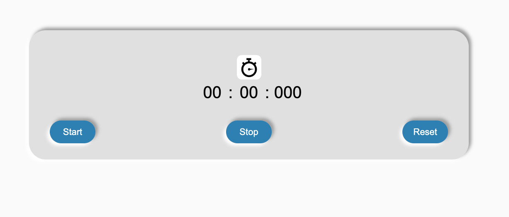

# Stop watch

> a simple stop watch, with `start`, `stop` and `reset` functionalities.

## Table of contents

- [General info](#general-info)
- [Screenshots](#screenshots)
- [Technologies](#technologies)
- [Setup](#setup)
- [Features](#features)
- [Status](#status)
- [Inspiration](#inspiration)
- [Contact](#contact)

## General info

the objective of this project is to practice separation of concerns and use `setInterval` and `stopInterval` APIs

## Screenshots



## Technologies

- JavaScript
- HTML5
- CSS3
- VSC code

## Setup

clone the repo and start using the stop watch.

## Code Examples

```js
'use strict';

import data from '../data.js';
import updateTime from '../utils/updateTime.js';
import updateTimeComponent from '../components/updateTimeUnits.js';

const startHandler = () => {
  if (data.intervalId !== null) {
    clearInterval(data.intervalId);
    data.intervalId = null;
  }

  data.intervalId = setInterval(() => {
    const time = updateTime();
    updateTimeComponent(time);
  }, 10);
};

export default startHandler;
```

## Features

List of features ready and Todos for future development

-
-
-

To-do list:

-
-

## Status

Project is: _in progress_

## Inspiration

## Contact

By [@Samir](https://github.com/samirm00)
